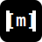

## 👋 About Me

Multidisciplinary **R&D Engineer** with a deep passion for the intersection of hardware and software. Currently working at **Power Electronics**, I specialize in **Embedded Systems**, **Acoustics**, and **Industrial Software Development**. My journey has been defined by a constant drive to learn and adapt, moving from fundamental acoustic research to building robust industrial systems.

## 🛠️ Tech Stack

### Languages

  
  
  
  
  
  

### Frameworks & Tools

  
  
  
  
  
  

### Infrastructure & Services

  
  
  
  
  

## 📝 Latest Blog Posts

<!-- BLOG-POSTS:START -->
<table>
<tr>
<td width="33%" valign="top">

### [MikroTik Honeypot: Trap & Auto-Block Port Scanners](https://jmrp.io/blog/implementing-mikrotik-honeypot/)
Learn how to configure your MikroTik router as a low-interaction honeypot to detect port scanners, log malicious activity, and automatically block ...

[Read more →](https://jmrp.io/blog/implementing-mikrotik-honeypot/)

</td>
<td width="33%" valign="top">

### [Implementing a Tarpit in Nginx: Trap Malicious Scanners](https://jmrp.io/blog/implementing-tarpit-nginx/)
Learn how to implement a tarpit in Nginx to slow down and trap malicious bots, vulnerability scanners, and brute-force attackers. Complete guide wi...

[Read more →](https://jmrp.io/blog/implementing-tarpit-nginx/)

</td>
<td width="33%" valign="top">

### [Mastering QUIC and HTTP/3 with Nginx: The Complete Guide](https://jmrp.io/blog/004-enabling-quic-http3-nginx/)
A comprehensive deep-dive into the QUIC protocol and HTTP/3. Learn the technical architecture, security features, and step-by-step Nginx configurat...

[Read more →](https://jmrp.io/blog/004-enabling-quic-http3-nginx/)

</td>
</tr>
</table>

  

<!-- BLOG-POSTS:END -->

  
  

## 🔗 Connect With Me

  
  
  

  

