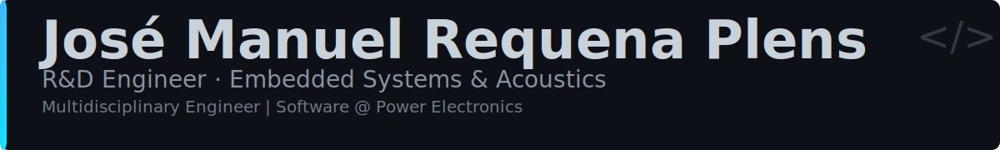

# José Manuel Requena Plens

  

 

## 👋 About Me

Multidisciplinary **R&D Engineer** with a deep passion for the intersection of hardware and software. Currently working at **Power Electronics**, I specialize in **Embedded Systems**, **Acoustics**, and **Industrial Software Development**. My journey has been defined by a constant drive to learn and adapt, moving from fundamental acoustic research to building robust industrial systems.

## 🛠️ Tech Stack

<b>Languages</b>

 

<b>Frameworks & Tools</b>

 

<b>Infrastructure & Services</b>

 

## 📝 Latest Blog Posts

<!-- BLOG-POST-LIST:START -->
<!-- BLOG-POST-LIST:END -->

> 📚 [Read more on my blog →](https://jmrp.io/blog)

## 📊 GitHub Stats

  
  

## 🔗 Connect With Me

  

---

  
### 💝 Support My Work

  

