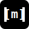
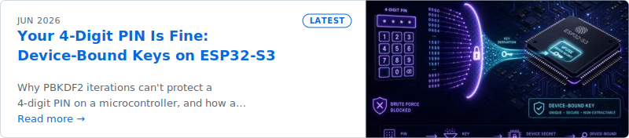
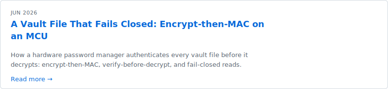
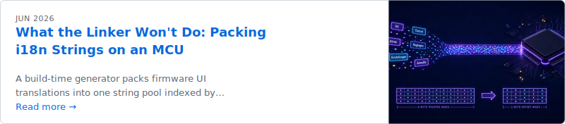

## 👋 About Me

Multidisciplinary **R&D Engineer** with a deep passion for the intersection of hardware and software. Currently working at **Power Electronics**, I specialize in **Embedded Systems**, **Acoustics**, and **Industrial Software Development**. My journey has been defined by a constant drive to learn and adapt, moving from fundamental acoustic research to building robust industrial systems.

## 🛠️ Tech Stack

### Languages

  
  
  
  
  
  

### Frameworks & Tools

  
  
  
  
  
  

### Infrastructure & Services

  
  
  
  
  

## 📝 Latest Blog Posts

<!-- BLOG-POSTS:START -->
<a href="https://jmrp.io/blog/012-device-bound-key-derivation/">
  <picture>
    <source media="(prefers-color-scheme: dark)" srcset="generated/blog-1-dark.svg"/>
    
  </picture>
</a>

<a href="https://jmrp.io/blog/011-encrypt-then-mac-vault/">
  <picture>
    <source media="(prefers-color-scheme: dark)" srcset="generated/blog-2-dark.svg"/>
    
  </picture>
</a>

<a href="https://jmrp.io/blog/010-packed-i18n-string-pool/">
  <picture>
    <source media="(prefers-color-scheme: dark)" srcset="generated/blog-3-dark.svg"/>
    
  </picture>
</a>

  

<!-- BLOG-POSTS:END -->

  
  

## 🔗 Connect With Me

  
  
  

  

