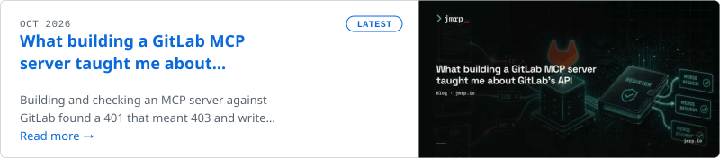
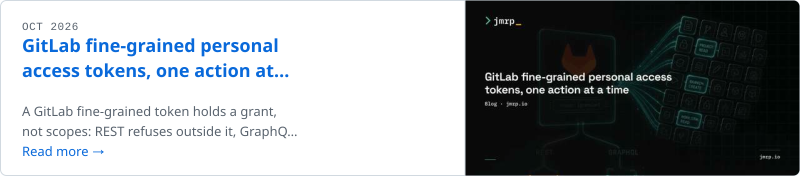
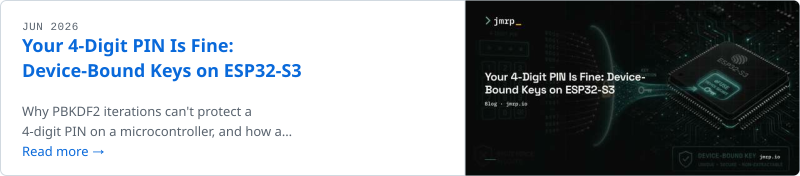

**Firmware & Software Engineer** with a **research** background. I moved from acoustics research — metamaterials, simulation and measurement — into designing embedded systems and the software around them: bare-metal MCUs, C, industrial communications and on-hardware testing.

  
  

<!-- BLOG-POSTS:START -->
<a href="https://jmrp.io/blog/013-gitlab-mcp-server-api-lessons/">
  <picture>
    <source media="(prefers-color-scheme: dark)" srcset="generated/blog-1-dark.svg"/>
    
  </picture>
</a>

<a href="https://jmrp.io/blog/014-gitlab-fine-grained-tokens-per-action/">
  <picture>
    <source media="(prefers-color-scheme: dark)" srcset="generated/blog-2-dark.svg"/>
    
  </picture>
</a>

<a href="https://jmrp.io/blog/012-device-bound-key-derivation/">
  <picture>
    <source media="(prefers-color-scheme: dark)" srcset="generated/blog-3-dark.svg"/>
    
  </picture>
</a>
<!-- BLOG-POSTS:END -->

  
  

  <a href="https://jmrp.io"><picture><source media="(prefers-color-scheme: dark)" srcset="generated/connect-website-dark.svg"/></picture></a>
  &nbsp;
  <a href="https://www.linkedin.com/in/jmrplens/"><picture><source media="(prefers-color-scheme: dark)" srcset="generated/connect-linkedin-dark.svg"/></picture></a>
  &nbsp;
  <a href="https://mstdn.jmrp.io/@jmrplens"><picture><source media="(prefers-color-scheme: dark)" srcset="generated/connect-mastodon-dark.svg"/></picture></a>

